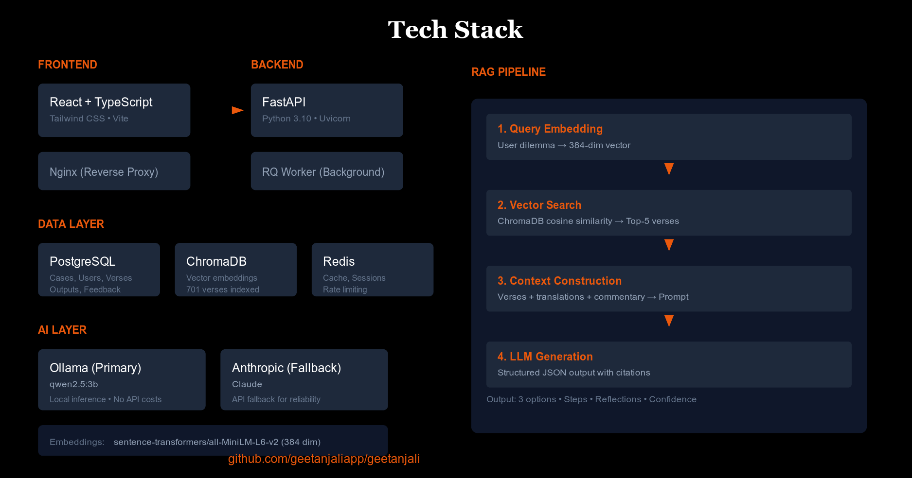

# Geetanjali

[](https://github.com/geetanjaliapp/geetanjali/actions/workflows/ci.yml)
[](LICENSE)
[](https://www.python.org/downloads/)
[](https://nodejs.org/)

Ethical leadership guidance grounded in Bhagavad Geeta wisdom.

**[Try it live](https://geetanjaliapp.com)** | **[Documentation](https://docs.geetanjaliapp.com)**



## Why Geetanjali?

Leaders face ethical dilemmas without clear answers. Do you lay off staff to save the company? Confront a colleague's misconduct? Balance profit with purpose?

The Bhagavad Geeta has guided ethical decision-making for millennia. Geetanjali makes this wisdom accessible through AI-powered consultation:

- **Structured analysis** of your ethical dilemma
- **Multiple options** with honest tradeoffs
- **Specific verse citations** grounding each recommendation
- **Practical steps** for implementation

No hallucinated advice. Every recommendation traces back to actual scripture through retrieval-augmented generation (RAG).

Free. Open source. Private by default.

## Features

### Consultation
- **Case Analysis** - Submit ethical dilemmas, get structured recommendations with verse citations
- **Follow-up Conversations** - Ask clarifying questions to refine guidance
- **Featured Cases** - Browse curated example consultations
- **Sharing** - Share cases publicly or via private link

### Discovery
- **Verse Browser** - Explore 701 verses across 18 chapters with translations
- **Topics** - Browse 16 consulting principles organized by yoga path (Karma, Jnana, Bhakti, Sadachara)
- **Reading Mode** - Distraction-free sequential reading, Sanskrit-first
- **Audio Recitations** - AI-generated Sanskrit verse audio with speed control and loop mode
- **Study Mode** - Guided narration with auto-advance: Sanskrit → English → Hindi → Insight
- **Listen/Read Modes** - Auto-advance through verses with audio or timed reading
- **Search** - Find verses by reference, Sanskrit, keywords, or meaning
- **Favorites** - Save verses for quick access
- **Verse Sharing** - Generate shareable images with Sanskrit and translation

### Platform
- **Themes** - 4 color themes (Default, Sutra, Serenity, Forest) with light/dark modes
- **Cross-device Sync** - Progress, favorites, themes, and preferences sync for logged-in users
- **Daily Wisdom** - Subscribe to daily verse emails
- **Offline Support** - Works without network after first load
- **Search Engine Friendly** - All 701 verses indexable with semantic HTML for bots
- **Confidence Scoring** - Low-confidence responses flagged for review

## Quick Start

Requirements: Docker and Docker Compose

```bash
git clone https://github.com/geetanjaliapp/geetanjali.git
cd geetanjali

# Pull audio files (requires Git LFS)
git lfs pull

# Start all services
docker compose up -d

# Pull LLM model (first time only, stored in volume)
docker exec geetanjali-ollama ollama pull qwen2.5:3b

# Check status
docker compose ps
```

Services:
- Frontend: http://localhost
- Backend API: http://localhost:8000
- API Docs: http://localhost:8000/docs

## Architecture

| Component | Technology |
|-----------|------------|
| Backend | FastAPI (Python 3.10+) |
| Frontend | React + TypeScript + Tailwind v4 |
| Database | PostgreSQL 15 |
| Vector DB | ChromaDB |
| Cache | Redis 7 |
| LLM | Ollama (local-first), Gemini, Anthropic with auto-tuned provider configs |
| Embeddings | sentence-transformers/all-MiniLM-L6-v2 |
| Audio | Indic Parler-TTS (AI4Bharat), Edge TTS |

The system uses circuit breakers for resilience. Each LLM provider has auto-tuned defaults: Ollama with simplified prompts, Gemini with explicit JSON schema, Anthropic native structured output. Cloud providers available as fallback. ChromaDB falls back to SQL keyword search. See [Architecture](docs/architecture.md) for details.

## Configuration

See [Setup Guide](docs/setup.md#configuration-reference) for all environment variables.

Essential for production:
```bash
JWT_SECRET=your-secret-key
API_KEY=your-api-key
LLM_PROVIDER=ollama  # local-first (or gemini, anthropic for cloud)
COOKIE_SECURE=true
```

## Development

See [Setup Guide](docs/setup.md) for detailed local development instructions.

### Commands

```bash
make dev          # Start development environment
make test         # Run tests
make lint         # Run linters
make format       # Format code
make db-migrate   # Run database migrations
make clean        # Clean up containers
```

### Testing

```bash
# Backend (from backend/)
pytest
pytest --cov=. --cov-report=term-missing

# Frontend (from frontend/)
npm test
```

## API

Key endpoints:

```
POST /api/v1/cases                  # Create case
POST /api/v1/cases/{id}/analyze/async  # Analyze case (async)
POST /api/v1/cases/{id}/follow-up   # Follow-up question
GET  /api/v1/verses                 # List verses
GET  /api/v1/verses/daily           # Daily verse
GET  /api/v1/topics                 # List topics by group
GET  /api/v1/topics/{id}            # Topic detail with verses
GET  /api/v1/search?q={query}       # Search verses
POST /api/v1/auth/signup            # Create account
POST /api/v1/auth/login             # Login
```

Full API documentation at `/docs` when running.

## Documentation

**[docs.geetanjaliapp.com](https://docs.geetanjaliapp.com)**

**User Journeys:**
- [Discovery Journey](docs/discovery.md) - Verse Browser and Reading Mode
- [Consultation Journey](docs/consultation.md) - Case analysis and follow-up
- [Search](docs/search.md) - Multi-strategy hybrid search
- [Audio Recitations](docs/audio.md) - Sanskrit verse audio playback

**Reference:**
- [Setup Guide](docs/setup.md) - Development environment and configuration
- [Architecture](docs/architecture.md) - System design, RAG pipeline, resilience
- [Deployment](docs/deployment.md) - Docker Compose and production setup
- [Observability](docs/observability.md) - Metrics, dashboards, alerting
- [Security](docs/security.md) - Container hardening, secrets management
- [Design](docs/design.md) - Frontend design language
- [Content Moderation](docs/content-moderation.md) - Abuse detection
- [Data Sources](docs/data.md) - Geeta content and licensing

## License

MIT

## Acknowledgments

Built with reverence for the Bhagavad Geeta. The Sanskrit texts and translations used are in the public domain. This project aims to make ancient wisdom accessible while respecting its sacred nature.
